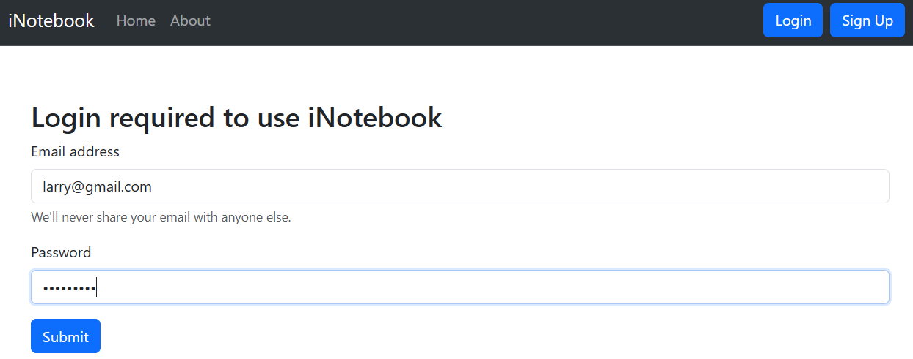
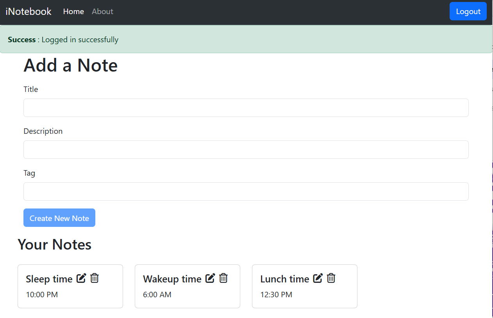
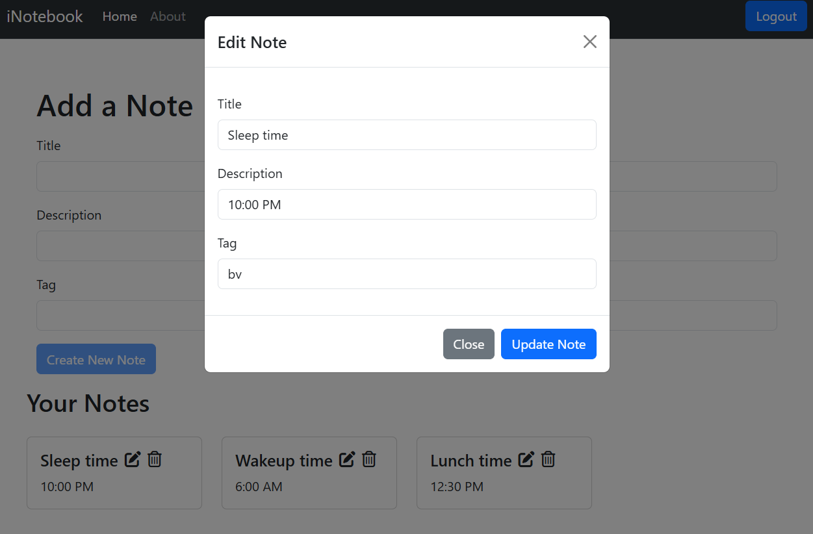
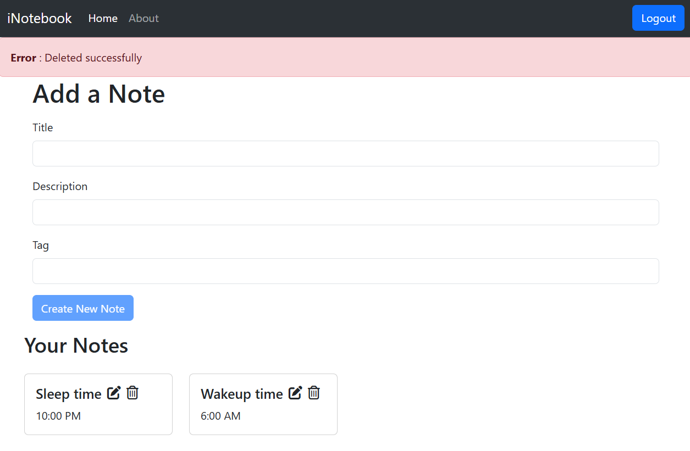
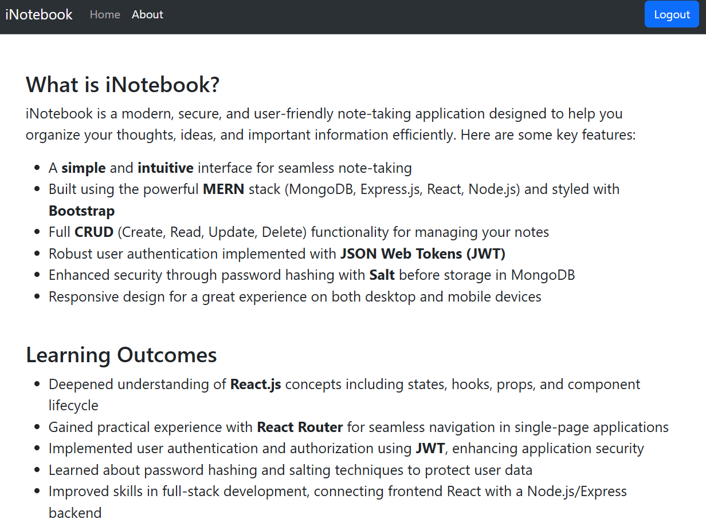

# iNotebook
## iNotebook is a modern, secure, and user-friendly note-taking application developed using MERN stack technologies.

## Some key features:

- A simple and intuitive interface for seamless note-taking
- Built using the powerful MERN stack (MongoDB, Express.js, React, Node.js) and styled with Bootstrap
- Full CRUD (Create, Read, Update, Delete) functionality for managing your notes
- Robust user authentication implemented with JSON Web Tokens (JWT)
- Enhanced security through password hashing with Salt before storage in MongoDB
- Responsive design for a great experience on both desktop and mobile devices

## Project Photos
- Login page
- 

- Home page
- 

- Edit note page
- 

- Delete note page
- 

- About page
- 

## Prerequisites

Before getting started, make sure you have the following installed:

- [Node.js](https://nodejs.org/) 
- [npm](https://www.npmjs.com/) 

## How to Run the Website Locally

Follow these steps to set up and run the JourneyGenie website on your local machine. And use command prompt to run the command. Don't user power shell as you might face errors in it.

### 1. Clone the Repository

First, clone the repository from the main branch using the following command:

```bash
git clone https://github.com/NandishDPatel/iNotebook.git
```

### 2. Navigate to the Project Folder

Change into the `iNotebook` directory on your local machine:

```bash
cd iNotebook
```

### 3. Install Dependencies

Run the following command to install the necessary npm packages and dependencies for frontend:

```bash
npm install
```

Run the following command to install the necessary npm packages and dependencies for backend:
```bash
cd backend
npm install
```

### 4. Run the Backend Server

Start the server by going inside the backend directory and running the following command:

```bash
nodemon index.js
```

Backend server will run at locally and accessible at `http://localhost:3000`.

### 5. Start the Development Server

Keep the backend server open and another terminal run the following command in base iNotebook directory 

```bash
npm start
```

The website should now be running locally and accessible at `http://localhost:5000`.

## Additional Information

- Make sure to configure these 3 environment variables by creating a new file inside the iNotebook/backend folder named as .env and set these 4 variables values for successfully running the project:
- 
  ```bash
  - DB_USERNAME=
  - DB_PASSWORD=
  - DB_NAME=
  - JWT_SECRET=
  ```
  
- For first 3 variable you can create a database inside the mongodb and then just fill those things using username, password and database name.
- You can give any random string for the JWT_SECRET.

## Learning Outcomes
- Deepened understanding of React.js concepts including states, hooks, props, and component lifecycle
- Gained practical experience with React Router for seamless navigation in single-page applications
- Implemented user authentication and authorization using JWT, enhancing application security
- Learned about password hashing and salting techniques to protect user data
- Improved skills in full-stack development, connecting frontend React with a Node.js/Express backend
- Practiced working with MongoDB, a popular NoSQL database, for efficient data storage and retrieval 
